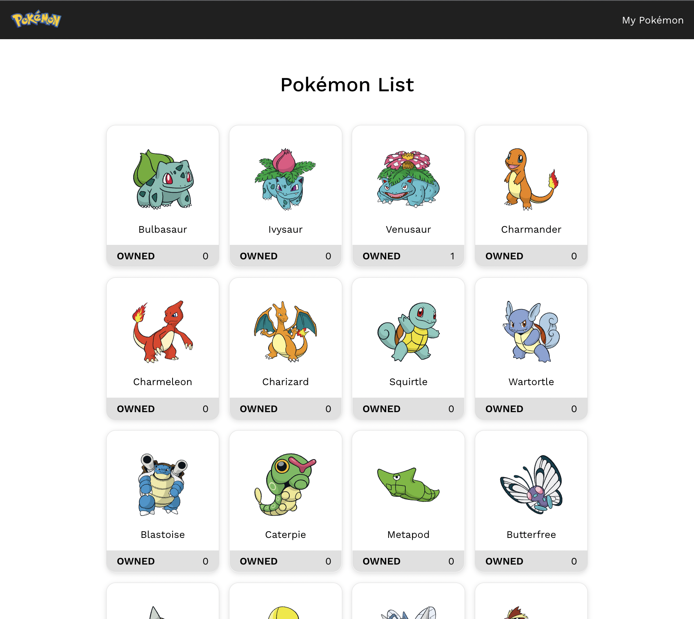
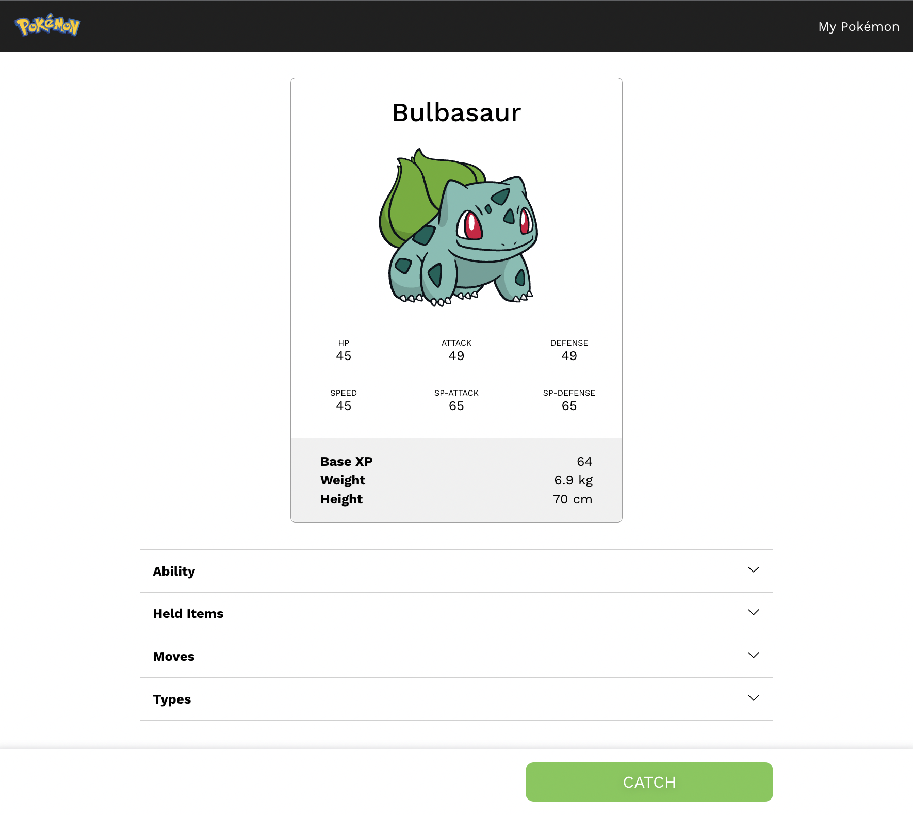
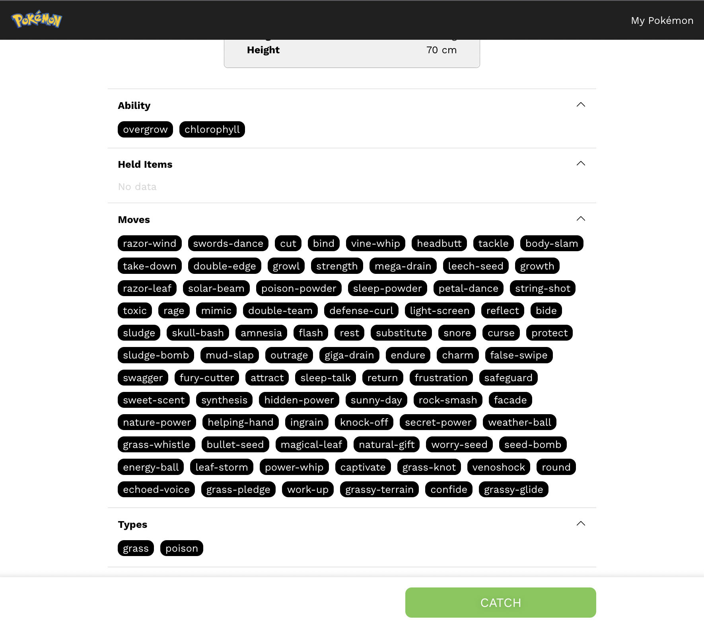
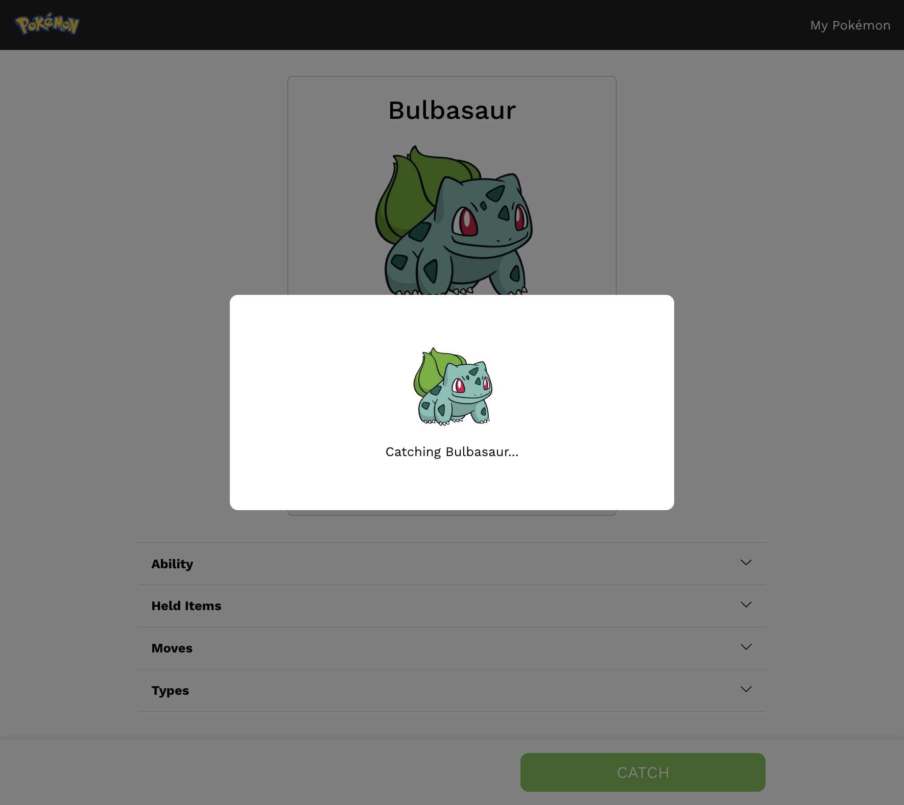
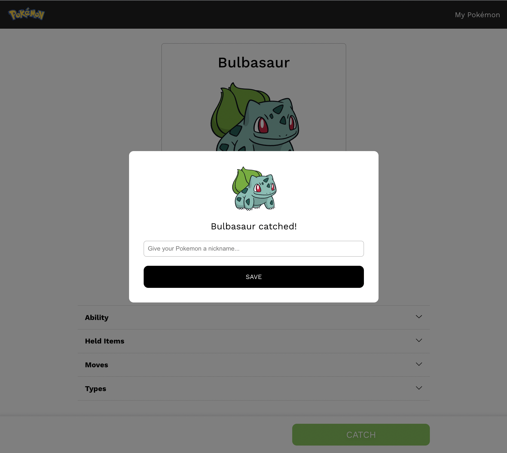
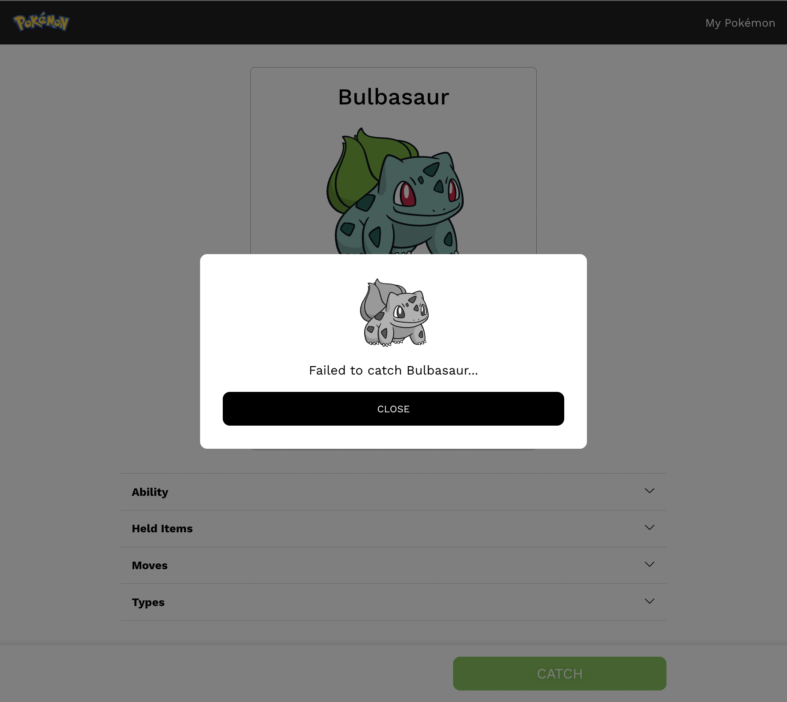
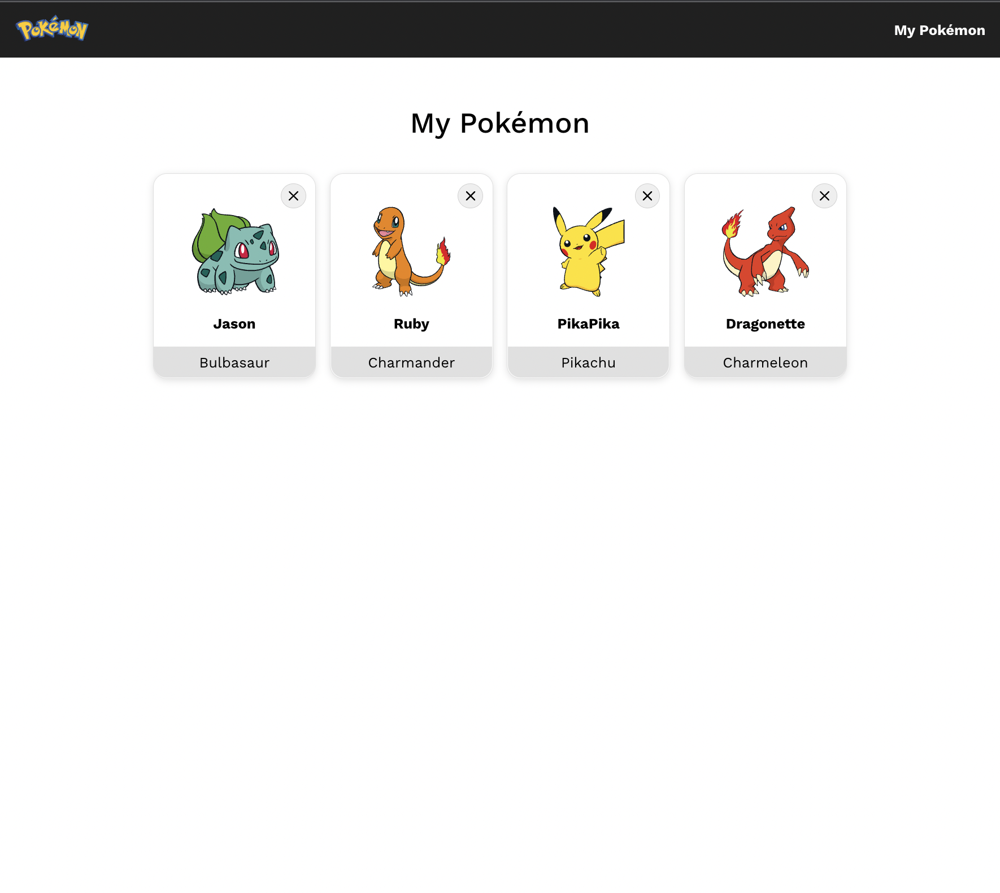

# Pokémon

Gotta catch 'em all.\
This is a website to show a list, details, and catch Pokemons. The Pokemon data are gathered from [PokeAPI](https://pokeapi.co/). This project was bootstrapped with [Create React App](https://github.com/facebook/create-react-app).

## Features

You can see the full list of available Pokémons as well as the number of that Pokémon that you own.\

Click a Pokémon to see its details! Here you can see its stats, abilities, items, moves, and types.\

Press the "CATCH" button to try to catch a Pokémon...\

...with 50% chance of getting it!\

You can visit "My Pokémon" to see a list of Pokémon that you catched including its nicknames. You can also release them if you want!\

## Homepage
You can visit the website on\
[https://poke-naufalmukhbit.surge.sh](https://poke-naufalmukhbit.surge.sh)

## Installation & Running

### Requirements
- Node ≥ 16.14.0

In the project directory, install the dependencies using:

### `npm install`

Then start the project, run it using:

### `npm start`

It will run the app in the development mode.\
Visit [http://localhost:3000](http://localhost:3000) to view it in the browser.

## To-Dos
- Implement PWA
- Create unit and integration tests using [Jest](https://github.com/facebook/jest)

## Credits

- [PokéAPI](https://pokeapi.co)
- [PokéAPI Sprites](https://github.com/PokeAPI/sprites)
- [Emotion](https://emotion.sh/)
- [Apollo GraphQL](https://www.apollographql.com/)
- [react-loading-skeleton](https://github.com/dvtng/react-loading-skeleton)
